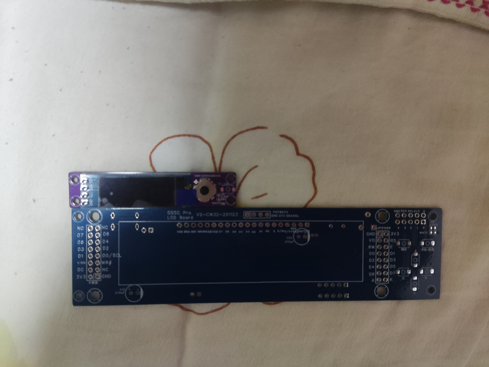

# US2066/SSD1311 OLED Replacement

Since the US2066/SSD1311 OLED screen is too large, expensive, and difficult to purchase, I instead use a CW32L012 MCU as an intermediate converter. It translates the US2066/SSD1311 text-only I²C commands into character bitmaps and sends them to an SSD1306 display. This allows the cheaper, smaller, and widely available SSD1306 to replace the US2066/SSD1311 for text output.

Note: ONLY tested with OSSC Pro (Firmware Version 0.77). Other applications or version are UNTESTED.

.jpg)

